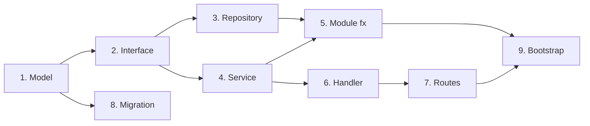
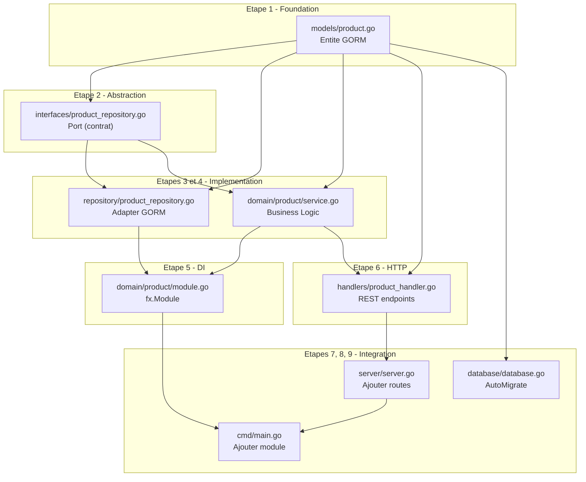

# Développement

<div class="navigation">
  <a href="index.md"><i class="material-icons">arrow_back</i> Guide Index</a>
</div>

---

## Workflow quotidien

**1. Lancer la base de données**

```bash
# Docker
docker start postgres
# ou
docker-compose up -d postgres

# Local
brew services start postgresql  # macOS
sudo systemctl start postgresql # Linux
```

**2. Lancer l'application**

```bash
make run
```

Ou avec hot-reload (si `air` installé):

```bash
# Installer air
go install github.com/cosmtrek/air@latest

# Lancer avec hot-reload
air
```

**3. Développer**

- Modifier le code
- Sauvegarder (auto-reload avec air)
- Vérifier les logs

**4. Tester**

```bash
# Tests unitaires
make test

# Tests avec coverage
make test-coverage

# Ouvrir le rapport
open coverage.html
```

**5. Linter**

```bash
make lint
```

### Commandes Makefile

| Commande | Description |
|----------|-------------|
| `make help` | Afficher l'aide |
| `make run` | Lancer l'app |
| `make build` | Build binaire |
| `make test` | Tests avec race detector |
| `make test-coverage` | Tests + rapport HTML |
| `make lint` | golangci-lint |
| `make clean` | Nettoyer artifacts |
| `make docker-build` | Build image Docker |
| `make docker-run` | Run conteneur Docker |

### Gestion des Modèles avec add-model <i class="material-icons success">new_releases</i>

**Nouveau dans v1.2.0!** Le générateur CRUD scaffolding automatise complètement la création de nouveaux modèles.

#### Workflow rapide

Au lieu de créer manuellement 8 fichiers et modifier 3 fichiers existants (voir section suivante), utilisez:

```bash
create-go-starter add-model <ModelName> --fields "field:type,..."
```

**Exemple:**
```bash
cd mon-projet  # Naviguer dans votre projet existant

# Créer un modèle Todo complet
create-go-starter add-model Todo --fields "title:string,completed:bool,priority:int"
```

**Résultat:** 8 fichiers générés + 3 fichiers mis à jour automatiquement en < 2 secondes.

#### Fichiers générés automatiquement

| Fichier | Rôle | Contenu |
|---------|------|---------|
| `internal/models/todo.go` | Entity | Struct avec tags GORM |
| `internal/interfaces/todo_repository.go` | Port | Interface repository |
| `internal/adapters/repository/todo_repository.go` | Adapter | Implémentation GORM |
| `internal/domain/todo/service.go` | Business Logic | CRUD operations |
| `internal/domain/todo/module.go` | fx Module | Injection de dépendances |
| `internal/adapters/handlers/todo_handler.go` | HTTP Adapter | REST endpoints |
| `internal/domain/todo/service_test.go` | Tests | Tests unitaires service |
| `internal/adapters/handlers/todo_handler_test.go` | Tests | Tests handlers HTTP |

#### Fichiers mis à jour automatiquement

| Fichier | Modification |
|---------|--------------|
| `internal/infrastructure/database/database.go` | Ajoute `&models.Todo{}` dans AutoMigrate |
| `internal/adapters/http/routes.go` | Ajoute routes CRUD `/api/v1/todos/*` |
| `cmd/main.go` | Ajoute `todo.Module` dans fx.New |

#### Types et modificateurs

**Types de champs supportés:**
- `string`, `int`, `uint`, `float64`, `bool`, `time`

**Modificateurs GORM:**
- `unique` - Contrainte d'unicité
- `not_null` - Champ obligatoire
- `index` - Index de base de données

**Syntaxe:**
```bash
--fields "field:type:modifier1:modifier2,..."
```

**Exemples:**
```bash
# Email unique et obligatoire
create-go-starter add-model User --fields "email:string:unique:not_null,age:int"

# Product avec prix et stock indexé
create-go-starter add-model Product --fields "name:string:unique,price:float64,stock:int:index"

# Article avec publication optionnelle
create-go-starter add-model Article --fields "title:string:not_null,content:string,published:bool"
```

#### Relations entre modèles

##### BelongsTo (N:1 - enfant vers parent)

Créer un modèle qui **appartient à** un parent existant:

```bash
# Le parent DOIT exister d'abord
create-go-starter add-model Category --fields "name:string:unique"

# Créer enfant avec relation BelongsTo
create-go-starter add-model Product --fields "name:string,price:float64" --belongs-to Category
```

**Ce qui est ajouté dans `internal/models/product.go`:**
```go
type Product struct {
    // ... champs custom
    CategoryID uint     `gorm:"not null;index" json:"category_id"`
    Category   Category `gorm:"foreignKey:CategoryID" json:"category,omitempty"`
}
```

**Routes imbriquées générées:**
- `GET /api/v1/categories/:categoryId/products` - Liste products d'une category
- `POST /api/v1/categories/:categoryId/products` - Créer product dans category

**Preloading:**
- `GET /api/v1/products/:id?include=category` - Product avec sa category

##### HasMany (1:N - parent vers enfants)

Ajouter un slice d'enfants à un **modèle parent existant**:

```bash
# Le parent ET l'enfant DOIVENT exister
create-go-starter add-model Category --fields "name:string"
create-go-starter add-model Product --fields "name:string" --belongs-to Category

# Ajouter HasMany au parent
create-go-starter add-model Category --has-many Product
```

**Ce qui est ajouté dans `internal/models/category.go`:**
```go
type Category struct {
    // ... champs existants
    Products []Product `gorm:"foreignKey:CategoryID" json:"products,omitempty"`
}
```

**Preloading:**
- `GET /api/v1/categories/:id?include=products` - Category avec tous ses products

##### Relations imbriquées (3+ niveaux)

Exemple: **Category** → **Post** → **Comment**

```bash
# 1. Créer la racine
create-go-starter add-model Category --fields "name:string:unique"

# 2. Créer niveau 2 (enfant de Category)
create-go-starter add-model Post \
  --fields "title:string:not_null,content:string,published:bool" \
  --belongs-to Category

# 3. Créer niveau 3 (enfant de Post)
create-go-starter add-model Comment \
  --fields "author:string:not_null,content:string:not_null" \
  --belongs-to Post

# 4. Optionnel: Ajouter HasMany aux parents
create-go-starter add-model Category --has-many Post
create-go-starter add-model Post --has-many Comment
```

**Résultat:**
- `Category` a `[]Post`
- `Post` a `CategoryID` + `Category` ET `[]Comment`
- `Comment` a `PostID` + `Post`

**Endpoints générés:**
```bash
# CRUD standard
GET    /api/v1/categories
GET    /api/v1/posts
GET    /api/v1/comments

# Relations imbriquées
GET    /api/v1/categories/:categoryId/posts
POST   /api/v1/categories/:categoryId/posts
GET    /api/v1/posts/:postId/comments
POST   /api/v1/posts/:postId/comments

# Preloading
GET    /api/v1/posts/:id?include=category,comments
GET    /api/v1/categories/:id?include=posts
```

#### Routes publiques vs protégées

**Par défaut**, toutes les routes sont **protégées par JWT** (middleware `auth.RequireAuth`).

Pour créer des **routes publiques** (sans authentification):

```bash
create-go-starter add-model Article --fields "title:string,content:string" --public
```

Cela génère:
```go
// routes.go - PAS de middleware auth
api.Get("/articles", articleHandler.List)
api.Post("/articles", articleHandler.Create)  // Public!
```

<i class="material-icons warning">warning</i> **Attention:** Utilisez `--public` avec précaution pour éviter les failles de sécurité.

#### Personnalisation après génération

Le code généré suit les best practices Go et peut être **facilement étendu**:

##### 1. Ajouter validations custom

```go
// internal/domain/todo/service.go
func (s *Service) Create(ctx context.Context, todo *models.Todo) error {
    // Validation métier custom
    if todo.Priority < 0 || todo.Priority > 10 {
        return domain.ErrValidation("priority must be between 0 and 10")
    }

    return s.repo.Create(ctx, todo)
}
```

##### 2. Ajouter méthodes métier

```go
// internal/models/todo.go
func (t *Todo) IsOverdue() bool {
    return t.DueDate.Before(time.Now()) && !t.Completed
}

func (t *Todo) MarkComplete() {
    t.Completed = true
    t.CompletedAt = time.Now()
}
```

##### 3. Ajouter endpoints custom

```go
// internal/adapters/handlers/todo_handler.go
func (h *Handler) MarkComplete(c *fiber.Ctx) error {
    id, _ := c.ParamsInt("id")

    todo, err := h.service.GetByID(c.Context(), uint(id))
    if err != nil {
        return err
    }

    todo.MarkComplete()
    return h.service.Update(c.Context(), uint(id), todo)
}

// internal/adapters/http/routes.go
todos.Put("/:id/complete", todoHandler.MarkComplete)
```

##### 4. Ajouter queries custom au repository

```go
// internal/interfaces/todo_repository.go
type TodoRepository interface {
    // ... méthodes CRUD générées
    FindOverdue(ctx context.Context) ([]models.Todo, error)
    FindByPriority(ctx context.Context, priority int) ([]models.Todo, error)
}

// internal/adapters/repository/todo_repository.go
func (r *Repository) FindOverdue(ctx context.Context) ([]models.Todo, error) {
    var todos []models.Todo
    err := r.db.WithContext(ctx).
        Where("due_date < ? AND completed = ?", time.Now(), false).
        Find(&todos).Error
    return todos, err
}
```

#### Relations avancées

##### Preloading multiple relations

```bash
# Post avec Category ET Comments
GET /api/v1/posts/:id?include=category,comments

# Category avec Posts, et chaque Post avec ses Comments
GET /api/v1/categories/:id?include=posts.comments
```

##### Eviter N+1 queries

Le code généré utilise automatiquement `Preload()` pour éviter N+1:

```go
// internal/adapters/repository/post_repository.go
func (r *Repository) GetByID(ctx context.Context, id uint) (*models.Post, error) {
    var post models.Post
    err := r.db.WithContext(ctx).
        Preload("Category").     // Charge la category en 1 query
        Preload("Comments").     // Charge les comments en 1 query
        First(&post, id).Error
    return &post, err
}
```

#### Workflow complet avec add-model

```bash
# 1. Créer projet initial
create-go-starter blog-api
cd blog-api
./setup.sh

# 2. Générer modèles
create-go-starter add-model Category --fields "name:string:unique"
create-go-starter add-model Post --fields "title:string,content:string" --belongs-to Category
create-go-starter add-model Comment --fields "author:string,content:string" --belongs-to Post

# 3. Rebuild et tester
go mod tidy
go build ./...
make test

# 4. Optionnel: Regénérer Swagger
make swagger

# 5. Lancer le serveur
make run

# 6. Tester l'API
curl -X POST http://localhost:8080/api/v1/categories \
  -H "Content-Type: application/json" \
  -d '{"name": "Technology"}'

curl -X POST http://localhost:8080/api/v1/categories/1/posts \
  -H "Content-Type: application/json" \
  -d '{"title": "Go is awesome", "content": "..."}'
```

#### Comparaison: add-model vs manuel

| Aspect | add-model | Manuel |
|--------|-----------|--------|
| **Temps** | < 2 secondes | ~30-60 minutes |
| **Fichiers créés** | 8 automatiquement | 8 manuellement |
| **Fichiers modifiés** | 3 automatiquement | 3 manuellement |
| **Erreurs** | Minimales (générateur testé) | Risque élevé (typos, oublis) |
| **Tests** | Générés automatiquement | À écrire manuellement |
| **Best practices** | Toujours respectées | Dépend du développeur |
| **Relations** | Support natif BelongsTo/HasMany | Configuration manuelle |
| **Personnalisation** | Facile après génération | Totale dès le début |

**Recommandation:** Utilisez `add-model` pour 90%+ des cas, puis personnalisez si besoin.

#### Limitations et workarounds

##### Pluralisation

Règles simples: `Todo→todos`, `Category→categories`, `Person→persons` (pas `people`)

**Workaround:** Éditez manuellement les fichiers pour pluriels irréguliers.

##### Relations many-to-many

Pas encore supportées nativement (prévu v1.3.0).

**Workaround:** Créez une table de jointure manuelle:

```bash
create-go-starter add-model UserRole \
  --fields "user_id:uint:index,role_id:uint:index"

# Puis éditez internal/models/user_role.go pour ajouter contrainte unique:
# UserID uint `gorm:"uniqueIndex:user_role_unique"`
# RoleID uint `gorm:"uniqueIndex:user_role_unique"`
```

#### Documentation complète

Pour plus de détails sur `add-model`, consultez:
- [Guide d'utilisation](./usage.md#ajouter-des-modeles-add-model)
- [Architecture CLI](./cli-architecture.md#21-générateur-de-modèles-add-model-command)
- [Changelog v1.2.0](../CHANGELOG.md#120---2026-02-12)

### Ajouter une nouvelle fonctionnalite (méthode manuelle)

Cette section vous guide pas a pas pour ajouter une nouvelle entite/fonctionnalite en respectant l'architecture hexagonale.

#### Vue d'ensemble des 9 etapes



#### Checklist rapide

Utilisez cette checklist pour ne rien oublier :

| Etape | Fichier a creer/modifier | Depend de | Status |
|-------|-------------------------|-----------|--------|
| 1. Model | `internal/models/<entity>.go` | - | [ ] |
| 2. Interface | `internal/interfaces/<entity>_repository.go` | Etape 1 | [ ] |
| 3. Repository | `internal/adapters/repository/<entity>_repository.go` | Etapes 1, 2 | [ ] |
| 4. Service | `internal/domain/<entity>/service.go` | Etapes 1, 2 | [ ] |
| 5. Module fx | `internal/domain/<entity>/module.go` | Etapes 3, 4 | [ ] |
| 6. Handler | `internal/adapters/handlers/<entity>_handler.go` | Etapes 1, 4 | [ ] |
| 7. Routes | `internal/infrastructure/server/server.go` (modifier) | Etape 6 | [ ] |
| 8. Migration | `internal/infrastructure/database/database.go` (modifier) | Etape 1 | [ ] |
| 9. Bootstrap | `cmd/main.go` (modifier) | Etape 5 | [ ] |

#### Diagramme des dependances entre fichiers

Ce diagramme montre l'ordre de creation des fichiers et leurs dependances :



---


---

## Navigation

**Previous**: [Configuration](configuration.md)  
**Next**: [Exemples pratiques](examples.md)  
**Index**: [Guide Index](index.md)
