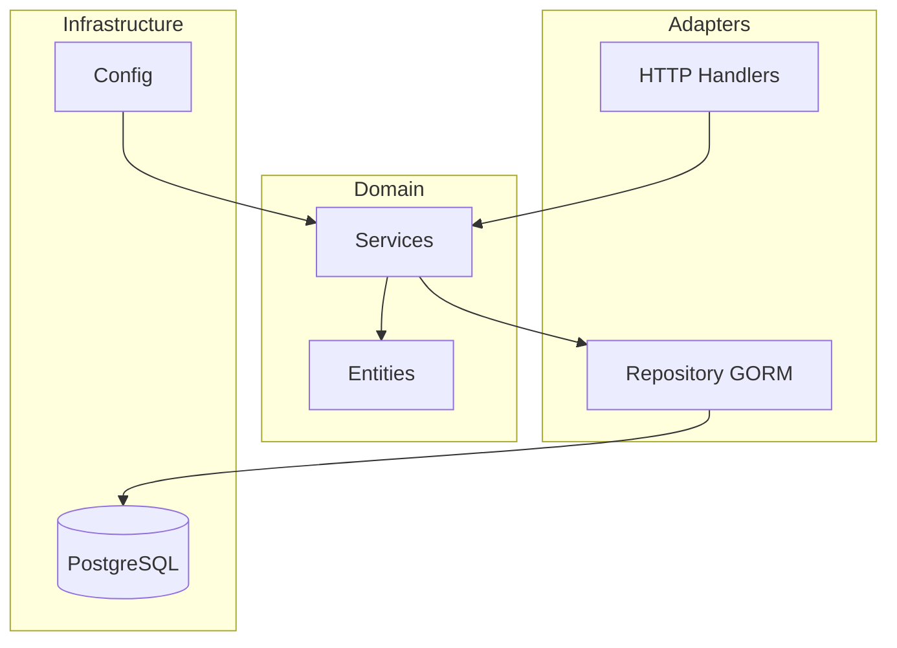

# Go Starter Kit

Un outil CLI puissant pour generer des projets Go prets pour la production en quelques secondes.

---

## :material-rocket-launch: Demarrage rapide

<div class="grid" markdown>

:material-rocket-launch: **[Installation](installation.md)** - Installez et creez votre premier projet en 30 secondes

:material-puzzle: **[Guide d'utilisation](usage.md)** - Structure de projet avec separation claire des responsabilites

:material-cog: **[Projet genere](generated-project-guide.md)** - JWT, Docker, CI/CD, tests et plus inclus par defaut

:material-heart: **[Contribuer](contributing.md)** - Contribuez au projet et ameliorez l'ecosysteme Go

</div>

---

## Apercu

`create-go-starter` est un generateur de projets Go qui cree une architecture hexagonale complete avec toutes les fonctionnalites essentielles d'une application backend moderne. En une seule commande, obtenez un projet structure avec authentification JWT, API REST, base de donnees, tests, et configuration Docker prete pour le deploiement.

## Fonctionnalites incluses

| Fonctionnalite | Description |
|----------------|-------------|
| :material-hexagon-outline: **Architecture hexagonale** | Ports & Adapters - Separation claire des responsabilites |
| :material-key: **Authentification JWT** | Access tokens + Refresh tokens avec rotation securisee |
| :material-api: **API REST** | Framework Fiber v2 haute performance |
| :material-database: **Base de donnees** | GORM avec PostgreSQL et migrations automatiques |
| :material-needle: **Injection de dependances** | uber-go/fx pour une architecture modulaire |
| :material-test-tube: **Tests complets** | Tests unitaires et d'integration inclus |
| :material-file-document: **Documentation Swagger** | API documentee automatiquement avec OpenAPI |
| :material-docker: **Docker** | Build multi-stage optimise et docker-compose |
| :material-git: **CI/CD** | Pipeline GitHub Actions pre-configure |
| :material-format-list-bulleted: **Logging structure** | rs/zerolog pour des logs professionnels |

## Installation rapide

=== "go install (Recommande)"

    ```bash
    go install github.com/tky0065/go-starter-kit/cmd/create-go-starter@latest
    ```

=== "Build depuis sources"

    ```bash
    git clone https://github.com/tky0065/go-starter-kit.git
    cd go-starter-kit
    go build -o create-go-starter ./cmd/create-go-starter
    ```

## Demarrage en 30 secondes

```bash
# 1. Installer l'outil
go install github.com/tky0065/go-starter-kit/cmd/create-go-starter@latest

# 2. Creer un projet
create-go-starter mon-projet

# 3. Configuration automatique
cd mon-projet
./setup.sh

# 4. Lancer
make run

# 5. Tester
curl http://localhost:8080/health
```

## Structure generee

```
mon-projet/
├── cmd/
│   └── main.go                    # Point d'entree avec fx
├── internal/
│   ├── models/                    # Entites de domaine
│   ├── domain/                    # Logique metier
│   ├── adapters/                  # HTTP handlers, repositories
│   │   ├── handlers/
│   │   ├── middleware/
│   │   └── repository/
│   ├── infrastructure/            # Database, server config
│   └── interfaces/                # Ports (interfaces)
├── pkg/                           # Packages reutilisables
│   ├── auth/                      # JWT utilities
│   ├── config/                    # Configuration
│   └── logger/                    # Logging
├── .github/workflows/ci.yml       # CI/CD
├── Dockerfile                     # Build optimise
├── Makefile                       # Commandes utiles
└── go.mod
```

## Stack technique

Les projets generes utilisent les meilleures bibliotheques de l'ecosysteme Go :

| Composant | Bibliotheque | Description |
|-----------|-------------|-------------|
| Web | [Fiber](https://gofiber.io/) v2 | Framework HTTP haute performance |
| ORM | [GORM](https://gorm.io/) | ORM avec support PostgreSQL |
| DI | [fx](https://uber-go.github.io/fx/) | Injection de dependances par Uber |
| Logging | [zerolog](https://github.com/rs/zerolog) | Logger structure haute performance |
| JWT | [golang-jwt](https://github.com/golang-jwt/jwt) v5 | Tokens JWT |
| Validation | [validator](https://github.com/go-playground/validator) v10 | Validation de structs |

## Architecture



## Prochaines etapes

- :material-download: **[Installation](installation.md)** - Guide d'installation detaille
- :material-book-open: **[Utilisation](usage.md)** - Apprendre a utiliser le CLI
- :material-wrench: **[Architecture](cli-architecture.md)** - Comprendre le fonctionnement interne
- :material-school: **[Tutoriel](tutorial-exemple-complet.md)** - Exemple complet pas a pas

---

**Fait avec :material-heart: pour la communaute Go**
