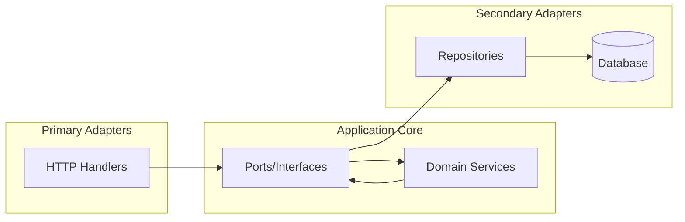

# Generated Project Guide

Complete guide for developing with projects created by `create-go-starter`.

!!! note "Translation in progress"
    This page is being translated from French. For the complete documentation, please refer to the [French version](../generated-project-guide/).

## Hexagonal Architecture

Generated projects follow the hexagonal architecture (Ports & Adapters) pattern:



## Directory Structure

| Directory | Purpose |
|-----------|---------|
| `cmd/` | Application entry point |
| `internal/models/` | Shared domain entities |
| `internal/domain/` | Business logic |
| `internal/adapters/` | HTTP handlers, repositories |
| `internal/infrastructure/` | Database, server config |
| `internal/interfaces/` | Port definitions |
| `pkg/` | Reusable packages |

## API Endpoints

### Authentication

| Method | Endpoint | Description |
|--------|----------|-------------|
| POST | `/api/v1/auth/register` | Register new user |
| POST | `/api/v1/auth/login` | Login |
| POST | `/api/v1/auth/refresh` | Refresh token |

### Users (Protected)

| Method | Endpoint | Description |
|--------|----------|-------------|
| GET | `/api/v1/users` | List users |
| GET | `/api/v1/users/:id` | Get user by ID |
| PUT | `/api/v1/users/:id` | Update user |
| DELETE | `/api/v1/users/:id` | Delete user |

## Example Usage

```bash
# Register
curl -X POST http://localhost:8080/api/v1/auth/register \
  -H "Content-Type: application/json" \
  -d '{"email":"user@example.com","password":"password123"}'

# Login
curl -X POST http://localhost:8080/api/v1/auth/login \
  -H "Content-Type: application/json" \
  -d '{"email":"user@example.com","password":"password123"}'

# Use token for protected endpoints
TOKEN="<access_token>"
curl -X GET http://localhost:8080/api/v1/users \
  -H "Authorization: Bearer $TOKEN"
```

## Adding New Features

### 1. Create Domain Entity

```go
// internal/models/product.go
type Product struct {
    ID    uint   `gorm:"primaryKey"`
    Name  string `gorm:"not null"`
    Price float64
}
```

### 2. Define Interface (Port)

```go
// internal/interfaces/product_repository.go
type ProductRepository interface {
    Create(ctx context.Context, product *models.Product) error
    FindByID(ctx context.Context, id uint) (*models.Product, error)
}
```

### 3. Implement Repository (Adapter)

```go
// internal/adapters/repository/product_repository.go
type productRepository struct {
    db *gorm.DB
}

func (r *productRepository) Create(ctx context.Context, product *models.Product) error {
    return r.db.WithContext(ctx).Create(product).Error
}
```

### 4. Create Service (Domain)

```go
// internal/domain/product/service.go
type Service struct {
    repo interfaces.ProductRepository
}

func (s *Service) CreateProduct(ctx context.Context, name string, price float64) (*models.Product, error) {
    product := &models.Product{Name: name, Price: price}
    return product, s.repo.Create(ctx, product)
}
```

### 5. Add HTTP Handler

```go
// internal/adapters/handlers/product_handler.go
func (h *ProductHandler) Create(c *fiber.Ctx) error {
    // Parse request, call service, return response
}
```

## Testing

```bash
# Run all tests
make test

# With coverage
make test-coverage

# Specific test
go test -v -run TestUserService ./internal/domain/user/
```

## Deployment

### Docker

```bash
# Build image
make docker-build

# Run container
make docker-run
```

### Environment Variables

```bash
APP_ENV=production
DB_HOST=your-db-host
DB_PASSWORD=secure-password
JWT_SECRET=your-secure-secret
```

## Next Steps

- [CLI Architecture](cli-architecture.md) - Understand the generator
- [Contributing](contributing.md) - Contribute to the project
