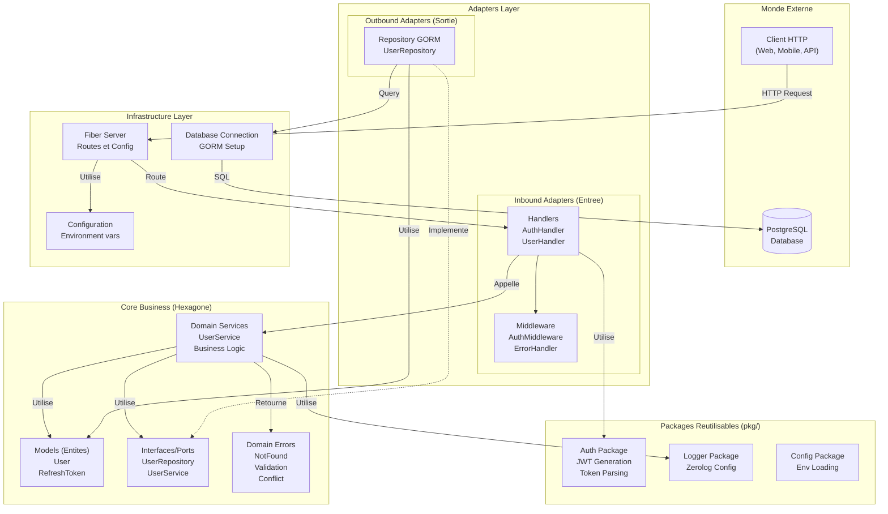
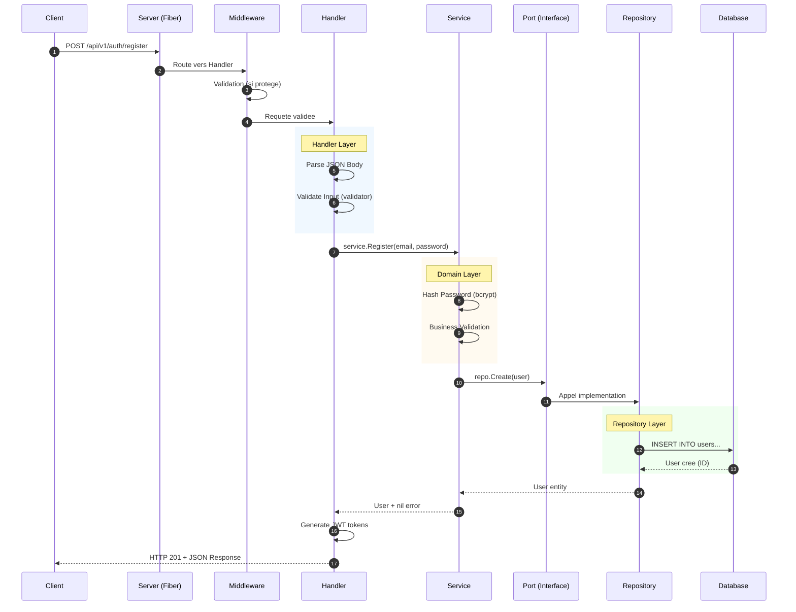
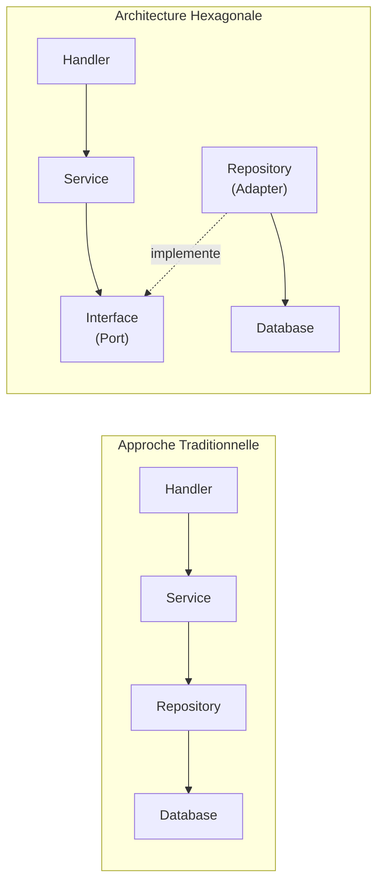
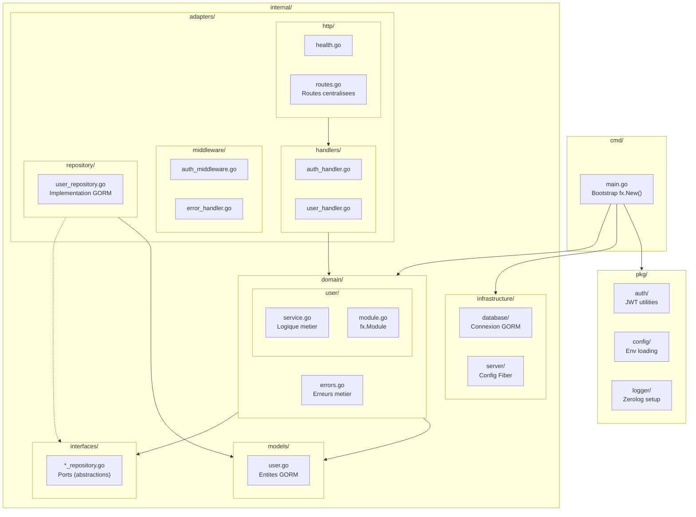

# Hexagonal Architecture

<div class="navigation">
  <a href="index.md"><i class="material-icons">arrow_back</i> Guide Index</a>
</div>

---

## Hexagonal Architecture (Ports & Adapters)

Generated projects follow hexagonal architecture, also known as "Ports and Adapters".

**Fundamental principle**: The business domain (business logic) is at the center and depends on nothing. All dependencies point toward the domain.

```
┌─────────────────────────────────────────────────────────┐
│                   HTTP Layer (Fiber)                    │
│              adapters/handlers + middleware             │
│  • AuthHandler (register, login, refresh)               │
│  • UserHandler (CRUD operations)                        │
│  • AuthMiddleware (JWT verification)                    │
│  • ErrorHandler (centralized error handling)            │
└───────────────────────┬─────────────────────────────────┘
                        │
                        ▼
┌─────────────────────────────────────────────────────────┐
│              Shared Entities Layer                      │
│                   models/                               │
│  • User (entity with GORM tags)                         │
│  • RefreshToken (entity with GORM tags)                 │
│  • AuthResponse (DTO)                                   │
└──────────┬───────────────────────────┬──────────────────┘
           │                           │
           ▼                           ▼
┌──────────────────────┐  ┌──────────────────────────────┐
│   Interfaces Layer   │  │      Domain Layer            │
│   interfaces/        │  │      domain/user             │
│  • UserRepository    │  │  • UserService (logic)       │
│    (port)            │  │  • Business rules            │
└──────────┬───────────┘  └──────────────────────────────┘
           │
           ▼
┌─────────────────────────────────────────────────────────┐
│              Infrastructure Layer                       │
│         database + repository + server                  │
│  • GORM Database Connection                             │
│  • UserRepository (GORM implementation)                 │
│  • Fiber Server Configuration                           │
└─────────────────────────────────────────────────────────┘
```

### Complete Architecture Diagram (Mermaid)

The following diagram shows the complete hexagonal architecture with all components and their interactions:



### HTTP Request Flow (Sequence Diagram)

This diagram shows the complete path of an HTTP request through the architecture:



### Dependency Inversion Principle

The core of hexagonal architecture relies on **Dependency Inversion**:



**Advantages of this approach**:

| Aspect | Without Hexagonal | With Hexagonal |
|--------|-------------------|----------------|
| **Testability** | Difficult (depends on DB) | Easy (mock interfaces) |
| **Database change** | Modifications everywhere | Only the repository |
| **Framework change** | Complete refactoring | Only the handlers |
| **Business logic** | Scattered | Centralized in the domain |

### File Structure and Responsibilities



**Data flow**:

1. **HTTP Request** → Handler (adapters/handlers)
2. **Handler** → Calls the Service via the interface (domain)
3. **Service** → Executes the business logic, calls the Repository via the interface
4. **Repository** → Persists to the DB (infrastructure)
5. **Return** → Flows back up to the Handler which returns the HTTP response

**Advantages**:

- **Testability**: The domain can be tested without DB or HTTP
- **Flexibility**: Easy to change DB (PostgreSQL → MySQL) or framework (Fiber → Gin)
- **Maintainability**: Clear separation of responsibilities
- **Scalability**: Add new features without breaking existing ones


---

## Navigation

**Next**: [Project Structure](structure.md)  
**Index**: [Guide Index](index.md)
