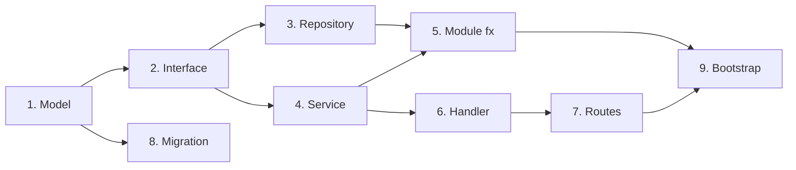
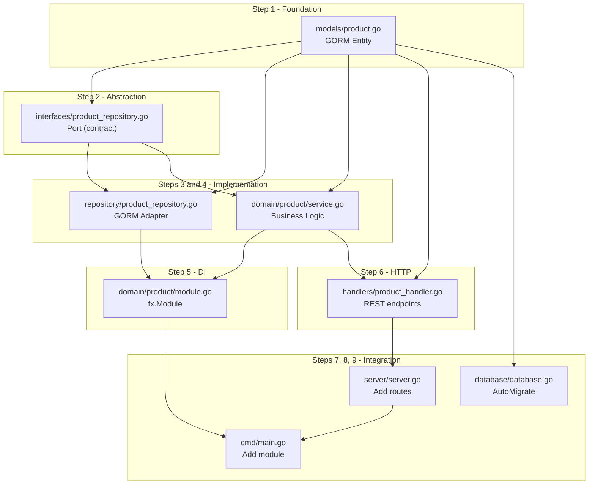

# Development

<div class="navigation">
  <a href="index.md"><i class="material-icons">arrow_back</i> Guide Index</a>
</div>

---

## Daily Workflow

**1. Start the database**

```bash
# Docker
docker start postgres
# or
docker-compose up -d postgres

# Local
brew services start postgresql  # macOS
sudo systemctl start postgresql # Linux
```

**2. Start the application**

```bash
make run
```

Or with hot-reload (if `air` is installed):

```bash
# Install air
go install github.com/cosmtrek/air@latest

# Start with hot-reload
air
```

**3. Develop**

- Modify the code
- Save (auto-reload with air)
- Check the logs

**4. Test**

```bash
# Unit tests
make test

# Tests with coverage
make test-coverage

# Open the report
open coverage.html
```

**5. Lint**

```bash
make lint
```

### Makefile Commands

| Command | Description |
|---------|-------------|
| `make help` | Display help |
| `make run` | Start the app |
| `make build` | Build binary |
| `make test` | Tests with race detector |
| `make test-coverage` | Tests + HTML report |
| `make lint` | golangci-lint |
| `make clean` | Clean artifacts |
| `make docker-build` | Build Docker image |
| `make docker-run` | Run Docker container |

### Model Management with add-model <i class="material-icons success">new_releases</i>

**New in v1.2.0!** The CRUD scaffolding generator fully automates the creation of new models.

#### Quick Workflow

Instead of manually creating 8 files and modifying 3 existing files (see next section), use:

```bash
create-go-starter add-model <ModelName> --fields "field:type,..."
```

**Example:**
```bash
cd mon-projet  # Navigate into your existing project

# Create a complete Todo model
create-go-starter add-model Todo --fields "title:string,completed:bool,priority:int"
```

**Result:** 8 files generated + 3 files automatically updated in < 2 seconds.

#### Automatically Generated Files

| File | Role | Content |
|------|------|---------|
| `internal/models/todo.go` | Entity | Struct with GORM tags |
| `internal/interfaces/todo_repository.go` | Port | Repository interface |
| `internal/adapters/repository/todo_repository.go` | Adapter | GORM implementation |
| `internal/domain/todo/service.go` | Business Logic | CRUD operations |
| `internal/domain/todo/module.go` | fx Module | Dependency injection |
| `internal/adapters/handlers/todo_handler.go` | HTTP Adapter | REST endpoints |
| `internal/domain/todo/service_test.go` | Tests | Service unit tests |
| `internal/adapters/handlers/todo_handler_test.go` | Tests | HTTP handler tests |

#### Automatically Updated Files

| File | Modification |
|------|-------------|
| `internal/infrastructure/database/database.go` | Adds `&models.Todo{}` in AutoMigrate |
| `internal/adapters/http/routes.go` | Adds CRUD routes `/api/v1/todos/*` |
| `cmd/main.go` | Adds `todo.Module` in fx.New |

#### Types and Modifiers

**Supported field types:**
- `string`, `int`, `uint`, `float64`, `bool`, `time`

**GORM modifiers:**
- `unique` - Uniqueness constraint
- `not_null` - Required field
- `index` - Database index

**Syntax:**
```bash
--fields "field:type:modifier1:modifier2,..."
```

**Examples:**
```bash
# Unique and required email
create-go-starter add-model User --fields "email:string:unique:not_null,age:int"

# Product with price and indexed stock
create-go-starter add-model Product --fields "name:string:unique,price:float64,stock:int:index"

# Article with optional publication
create-go-starter add-model Article --fields "title:string:not_null,content:string,published:bool"
```

#### Relationships Between Models

##### BelongsTo (N:1 - child to parent)

Create a model that **belongs to** an existing parent:

```bash
# The parent MUST exist first
create-go-starter add-model Category --fields "name:string:unique"

# Create child with BelongsTo relationship
create-go-starter add-model Product --fields "name:string,price:float64" --belongs-to Category
```

**What is added in `internal/models/product.go`:**
```go
type Product struct {
    // ... custom fields
    CategoryID uint     `gorm:"not null;index" json:"category_id"`
    Category   Category `gorm:"foreignKey:CategoryID" json:"category,omitempty"`
}
```

**Generated nested routes:**
- `GET /api/v1/categories/:categoryId/products` - List products of a category
- `POST /api/v1/categories/:categoryId/products` - Create product in a category

**Preloading:**
- `GET /api/v1/products/:id?include=category` - Product with its category

##### HasMany (1:N - parent to children)

Add a slice of children to an **existing parent model**:

```bash
# Both the parent AND child MUST exist
create-go-starter add-model Category --fields "name:string"
create-go-starter add-model Product --fields "name:string" --belongs-to Category

# Add HasMany to the parent
create-go-starter add-model Category --has-many Product
```

**What is added in `internal/models/category.go`:**
```go
type Category struct {
    // ... existing fields
    Products []Product `gorm:"foreignKey:CategoryID" json:"products,omitempty"`
}
```

**Preloading:**
- `GET /api/v1/categories/:id?include=products` - Category with all its products

##### Nested Relationships (3+ levels)

Example: **Category** → **Post** → **Comment**

```bash
# 1. Create the root
create-go-starter add-model Category --fields "name:string:unique"

# 2. Create level 2 (child of Category)
create-go-starter add-model Post \
  --fields "title:string:not_null,content:string,published:bool" \
  --belongs-to Category

# 3. Create level 3 (child of Post)
create-go-starter add-model Comment \
  --fields "author:string:not_null,content:string:not_null" \
  --belongs-to Post

# 4. Optional: Add HasMany to parents
create-go-starter add-model Category --has-many Post
create-go-starter add-model Post --has-many Comment
```

**Result:**
- `Category` has `[]Post`
- `Post` has `CategoryID` + `Category` AND `[]Comment`
- `Comment` has `PostID` + `Post`

**Generated endpoints:**
```bash
# Standard CRUD
GET    /api/v1/categories
GET    /api/v1/posts
GET    /api/v1/comments

# Nested relationships
GET    /api/v1/categories/:categoryId/posts
POST   /api/v1/categories/:categoryId/posts
GET    /api/v1/posts/:postId/comments
POST   /api/v1/posts/:postId/comments

# Preloading
GET    /api/v1/posts/:id?include=category,comments
GET    /api/v1/categories/:id?include=posts
```

#### Public vs Protected Routes

**By default**, all routes are **protected by JWT** (middleware `auth.RequireAuth`).

To create **public routes** (without authentication):

```bash
create-go-starter add-model Article --fields "title:string,content:string" --public
```

This generates:
```go
// routes.go - NO auth middleware
api.Get("/articles", articleHandler.List)
api.Post("/articles", articleHandler.Create)  // Public!
```

<i class="material-icons warning">warning</i> **Warning:** Use `--public` with caution to avoid security vulnerabilities.

#### Customization After Generation

The generated code follows Go best practices and can be **easily extended**:

##### 1. Add custom validations

```go
// internal/domain/todo/service.go
func (s *Service) Create(ctx context.Context, todo *models.Todo) error {
    // Custom business validation
    if todo.Priority < 0 || todo.Priority > 10 {
        return domain.ErrValidation("priority must be between 0 and 10")
    }

    return s.repo.Create(ctx, todo)
}
```

##### 2. Add business methods

```go
// internal/models/todo.go
func (t *Todo) IsOverdue() bool {
    return t.DueDate.Before(time.Now()) && !t.Completed
}

func (t *Todo) MarkComplete() {
    t.Completed = true
    t.CompletedAt = time.Now()
}
```

##### 3. Add custom endpoints

```go
// internal/adapters/handlers/todo_handler.go
func (h *Handler) MarkComplete(c *fiber.Ctx) error {
    id, _ := c.ParamsInt("id")

    todo, err := h.service.GetByID(c.Context(), uint(id))
    if err != nil {
        return err
    }

    todo.MarkComplete()
    return h.service.Update(c.Context(), uint(id), todo)
}

// internal/adapters/http/routes.go
todos.Put("/:id/complete", todoHandler.MarkComplete)
```

##### 4. Add custom queries to the repository

```go
// internal/interfaces/todo_repository.go
type TodoRepository interface {
    // ... generated CRUD methods
    FindOverdue(ctx context.Context) ([]models.Todo, error)
    FindByPriority(ctx context.Context, priority int) ([]models.Todo, error)
}

// internal/adapters/repository/todo_repository.go
func (r *Repository) FindOverdue(ctx context.Context) ([]models.Todo, error) {
    var todos []models.Todo
    err := r.db.WithContext(ctx).
        Where("due_date < ? AND completed = ?", time.Now(), false).
        Find(&todos).Error
    return todos, err
}
```

#### Advanced Relationships

##### Preloading multiple relationships

```bash
# Post with Category AND Comments
GET /api/v1/posts/:id?include=category,comments

# Category with Posts, and each Post with its Comments
GET /api/v1/categories/:id?include=posts.comments
```

##### Avoiding N+1 queries

The generated code automatically uses `Preload()` to avoid N+1:

```go
// internal/adapters/repository/post_repository.go
func (r *Repository) GetByID(ctx context.Context, id uint) (*models.Post, error) {
    var post models.Post
    err := r.db.WithContext(ctx).
        Preload("Category").     // Loads the category in 1 query
        Preload("Comments").     // Loads the comments in 1 query
        First(&post, id).Error
    return &post, err
}
```

#### Complete Workflow with add-model

```bash
# 1. Create initial project
create-go-starter blog-api
cd blog-api
./setup.sh

# 2. Generate models
create-go-starter add-model Category --fields "name:string:unique"
create-go-starter add-model Post --fields "title:string,content:string" --belongs-to Category
create-go-starter add-model Comment --fields "author:string,content:string" --belongs-to Post

# 3. Rebuild and test
go mod tidy
go build ./...
make test

# 4. Optional: Regenerate Swagger
make swagger

# 5. Start the server
make run

# 6. Test the API
curl -X POST http://localhost:8080/api/v1/categories \
  -H "Content-Type: application/json" \
  -d '{"name": "Technology"}'

curl -X POST http://localhost:8080/api/v1/categories/1/posts \
  -H "Content-Type: application/json" \
  -d '{"title": "Go is awesome", "content": "..."}'
```

#### Comparison: add-model vs Manual

| Aspect | add-model | Manual |
|--------|-----------|--------|
| **Time** | < 2 seconds | ~30-60 minutes |
| **Files created** | 8 automatically | 8 manually |
| **Files modified** | 3 automatically | 3 manually |
| **Errors** | Minimal (tested generator) | High risk (typos, omissions) |
| **Tests** | Automatically generated | Must be written manually |
| **Best practices** | Always followed | Depends on the developer |
| **Relationships** | Native BelongsTo/HasMany support | Manual configuration |
| **Customization** | Easy after generation | Full control from the start |

**Recommendation:** Use `add-model` for 90%+ of cases, then customize as needed.

#### Limitations and Workarounds

##### Pluralization

Simple rules: `Todo→todos`, `Category→categories`, `Person→persons` (not `people`)

**Workaround:** Manually edit the files for irregular plurals.

##### Many-to-many relationships

Not yet natively supported (planned for a future release).

**Workaround:** Create a manual join table:

```bash
create-go-starter add-model UserRole \
  --fields "user_id:uint:index,role_id:uint:index"

# Then edit internal/models/user_role.go to add a unique constraint:
# UserID uint `gorm:"uniqueIndex:user_role_unique"`
# RoleID uint `gorm:"uniqueIndex:user_role_unique"`
```

#### Full Documentation

For more details on `add-model`, see:
- [Usage Guide](./usage.md#ajouter-des-modeles-add-model)
- [CLI Architecture](./cli-architecture.md#21-générateur-de-modèles-add-model-command)
- [Changelog v1.2.0](../CHANGELOG.md#120---2026-02-12)

### Adding a New Feature (Manual Method)

This section guides you step by step through adding a new entity/feature while following the hexagonal architecture.

#### Overview of the 9 Steps



#### Quick Checklist

Use this checklist to make sure you don't miss anything:

| Step | File to create/modify | Depends on | Status |
|------|----------------------|------------|--------|
| 1. Model | `internal/models/<entity>.go` | - | [ ] |
| 2. Interface | `internal/interfaces/<entity>_repository.go` | Step 1 | [ ] |
| 3. Repository | `internal/adapters/repository/<entity>_repository.go` | Steps 1, 2 | [ ] |
| 4. Service | `internal/domain/<entity>/service.go` | Steps 1, 2 | [ ] |
| 5. Module fx | `internal/domain/<entity>/module.go` | Steps 3, 4 | [ ] |
| 6. Handler | `internal/adapters/handlers/<entity>_handler.go` | Steps 1, 4 | [ ] |
| 7. Routes | `internal/infrastructure/server/server.go` (modify) | Step 6 | [ ] |
| 8. Migration | `internal/infrastructure/database/database.go` (modify) | Step 1 | [ ] |
| 9. Bootstrap | `cmd/main.go` (modify) | Step 5 | [ ] |

#### File Dependency Diagram

This diagram shows the order of file creation and their dependencies:



---


---

## Navigation

**Previous**: [Configuration](configuration.md)  
**Next**: [Practical Examples](examples.md)  
**Index**: [Guide Index](index.md)
