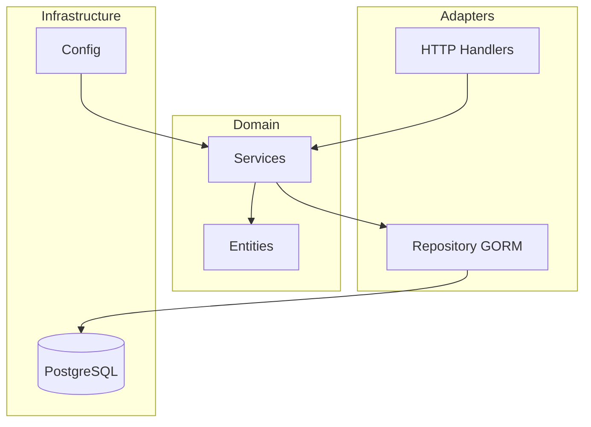

# Go Starter Kit

A powerful CLI tool to generate production-ready Go projects in seconds.

---

## :material-rocket-launch: Quick Start

<div class="grid" markdown>

:material-rocket-launch: **[Installation](installation.md)** - Install and create your first project in 30 seconds

:material-puzzle: **[Usage Guide](usage.md)** - Project structure with clear separation of concerns

:material-cog: **[Generated Project](generated-project-guide.md)** - JWT, Docker, CI/CD, tests and more included by default

:material-heart: **[Contributing](contributing.md)** - Contribute to the project and improve the Go ecosystem

</div>

---

## Overview

`create-go-starter` is a Go project generator that creates a complete hexagonal architecture with all the essential features of a modern backend application. With a single command, get a structured project with JWT authentication, REST API, database, tests, and Docker configuration ready for deployment.

## Included Features

| Feature | Description |
|---------|-------------|
| :material-hexagon-outline: **Hexagonal Architecture** | Ports & Adapters - Clear separation of concerns |
| :material-key: **JWT Authentication** | Access tokens + Refresh tokens with secure rotation |
| :material-api: **REST API** | High-performance Fiber v2 framework |
| :material-database: **Database** | GORM with PostgreSQL and automatic migrations |
| :material-needle: **Dependency Injection** | uber-go/fx for modular architecture |
| :material-test-tube: **Complete Tests** | Unit and integration tests included |
| :material-file-document: **Swagger Documentation** | Automatically documented API with OpenAPI |
| :material-docker: **Docker** | Optimized multi-stage build and docker-compose |
| :material-git: **CI/CD** | Pre-configured GitHub Actions pipeline |
| :material-format-list-bulleted: **Structured Logging** | rs/zerolog for professional logs |

## Quick Installation

=== "go install (Recommended)"

    ```bash
    go install github.com/tky0065/go-starter-kit/cmd/create-go-starter@latest
    ```

=== "Build from source"

    ```bash
    git clone https://github.com/tky0065/go-starter-kit.git
    cd go-starter-kit
    go build -o create-go-starter ./cmd/create-go-starter
    ```

## Get Started in 30 Seconds

```bash
# 1. Install the tool
go install github.com/tky0065/go-starter-kit/cmd/create-go-starter@latest

# 2. Create a project
create-go-starter my-project

# 3. Automatic setup
cd my-project
./setup.sh

# 4. Run
make run

# 5. Test
curl http://localhost:8080/health
```

## Generated Structure

```
my-project/
├── cmd/
│   └── main.go                    # Entry point with fx
├── internal/
│   ├── models/                    # Domain entities
│   ├── domain/                    # Business logic
│   ├── adapters/                  # HTTP handlers, repositories
│   │   ├── handlers/
│   │   ├── middleware/
│   │   └── repository/
│   ├── infrastructure/            # Database, server config
│   └── interfaces/                # Ports (interfaces)
├── pkg/                           # Reusable packages
│   ├── auth/                      # JWT utilities
│   ├── config/                    # Configuration
│   └── logger/                    # Logging
├── .github/workflows/ci.yml       # CI/CD
├── Dockerfile                     # Optimized build
├── Makefile                       # Useful commands
└── go.mod
```

## Tech Stack

Generated projects use the best libraries from the Go ecosystem:

| Component | Library | Description |
|-----------|---------|-------------|
| Web | [Fiber](https://gofiber.io/) v2 | High-performance HTTP framework |
| ORM | [GORM](https://gorm.io/) | ORM with PostgreSQL support |
| DI | [fx](https://uber-go.github.io/fx/) | Dependency injection by Uber |
| Logging | [zerolog](https://github.com/rs/zerolog) | High-performance structured logger |
| JWT | [golang-jwt](https://github.com/golang-jwt/jwt) v5 | JWT tokens |
| Validation | [validator](https://github.com/go-playground/validator) v10 | Struct validation |

## Architecture



## Next Steps

- :material-download: **[Installation](installation.md)** - Detailed installation guide
- :material-book-open: **[Usage](usage.md)** - Learn to use the CLI
- :material-wrench: **[Architecture](cli-architecture.md)** - Understand internals
- :material-school: **[Tutorial](tutorial-exemple-complet.md)** - Complete step-by-step example

---

**Made with :material-heart: for the Go community**
