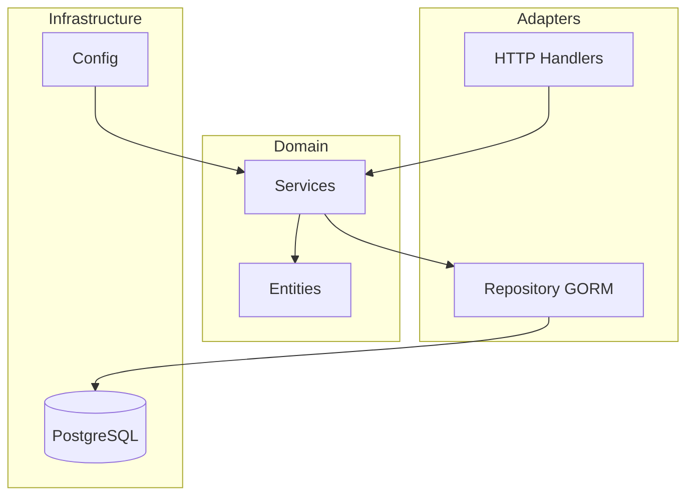

# create-go-starter

A powerful CLI tool to generate production-ready Go projects in seconds.

## <i class="material-icons info">info</i> About

**create-go-starter** is a stable, production-ready CLI generator for modern Go applications.

- <i class="material-icons success">check</i> **Stable version** - v1.4.0 available
- <i class="material-icons success">check</i> **3 templates** - minimal, full, GraphQL
- <i class="material-icons success">check</i> **Tested and validated** - Used in production
- <i class="material-icons success">check</i> **Open source** - MIT License
- <i class="material-icons success">check</i> **Actively maintained** - Regular updates

## Overview

`create-go-starter` is a Go project generator that creates a complete hexagonal architecture with all the essential features of a modern backend application. With a single command, get a structured project with JWT authentication, REST API, database, tests, and Docker configuration ready for deployment.

### Included Features

- **Hexagonal Architecture** (Ports & Adapters) - Clear separation of concerns
- **JWT Authentication** - Access tokens + Refresh tokens with secure rotation
- **REST API** with Fiber v2 - High-performance web framework
- **Database** - GORM with PostgreSQL and automatic migrations
- **Dependency Injection** - uber-go/fx for modular architecture
- **Complete Tests** - Unit and integration tests included
- **Swagger Documentation** - Automatically documented API with OpenAPI
- **Docker** - Optimized multi-stage build and docker-compose
- **CI/CD** - Pre-configured GitHub Actions pipeline
- **Structured Logging** - rs/zerolog for professional logs
- **Validation** - go-playground/validator for input validation
- **Makefile** - Useful commands for dev, test, build and deployment

### <i class="material-icons success">new_releases</i> New in v1.2.0: CRUD Generator

**Add new models in 2 seconds!** The `add-model` command automatically generates all the necessary CRUD code:

```bash
cd my-project
create-go-starter add-model Todo --fields "title:string,completed:bool"
```

**What is automatically generated:**
- <i class="material-icons success small">check</i> Model with GORM tags
- <i class="material-icons success small">check</i> Repository (interface + implementation)
- <i class="material-icons success small">check</i> Service (business logic)
- <i class="material-icons success small">check</i> HTTP Handlers (REST endpoints)
- <i class="material-icons success small">check</i> Tests (unit + integration)
- <i class="material-icons success small">check</i> Routes, migrations, fx modules

**Supported relations:**
- `--belongs-to Parent` - N:1 relation (child → parent)
- `--has-many Child` - 1:N relation (parent → children)

**Example with relations:**
```bash
create-go-starter add-model Category --fields "name:string:unique"
create-go-starter add-model Post --fields "title:string,content:string" --belongs-to Category
create-go-starter add-model Comment --fields "author:string,content:string" --belongs-to Post
```

**Result:** Complete blog (Category → Post → Comment) with nested endpoints and preloading.

<i class="material-icons">arrow_forward</i> [Full add-model guide](./usage.md#adding-models-add-model)

### <i class="material-icons success">new_releases</i> New in v1.3.0: Advanced Observability

**Production-ready monitoring in one command!** The `--observability=advanced` flag generates a complete observability stack:

```bash
create-go-starter my-app --template=full --observability=advanced
```

**What is automatically generated:**
- <i class="material-icons success small">check</i> **Prometheus Metrics** — `/metrics` endpoint with HTTP metrics (latency, throughput, errors)
- <i class="material-icons success small">check</i> **Distributed Tracing** — OpenTelemetry + Jaeger with W3C traceparent propagation
- <i class="material-icons success small">check</i> **K8s Health Checks** — `/health/liveness` and `/health/readiness` with DB verification
- <i class="material-icons success small">check</i> **Grafana Dashboard** — Pre-configured 7-panel dashboard with alerting
- <i class="material-icons success small">check</i> **Docker Compose** — Complete stack (Jaeger + Prometheus + Grafana)
- <i class="material-icons success small">check</i> **Kubernetes Probes** — Auto-generated `probes.yaml` file

<i class="material-icons">arrow_forward</i> [Full observability guide](./usage.md#observability---observability)

### <i class="material-icons success">new_releases</i> New in v1.4.0: CLI Enhancements

**Redesigned developer experience!** Guided interactive mode, dry-run preview, environment diagnostics, and short aliases for all flags.

```bash
# Guided interactive mode
create-go-starter -i

# Preview without creating
create-go-starter my-app --dry-run

# Environment diagnostics
create-go-starter doctor

# Short aliases for all flags
create-go-starter -t minimal -d sqlite -n my-app
```

**v1.4.0 New features:**
- <i class="material-icons success small">check</i> **Interactive Mode** (`--interactive` / `-i`) — Step-by-step guided assistant
- <i class="material-icons success small">check</i> **Dry-Run** (`--dry-run` / `-n`) — File preview without writing
- <i class="material-icons success small">check</i> **Doctor** (`create-go-starter doctor`) — Go, Git, Docker diagnostics
- <i class="material-icons success small">check</i> **Progress Bar** — Visual feedback during generation
- <i class="material-icons success small">check</i> **Short Aliases** — `-t`, `-d`, `-o`, `-i`, `-n`, `-h`

<i class="material-icons">arrow_forward</i> [Full CLI enhancements guide](./usage.md#interactive-mode---interactive)

## Quick Installation

### Method 1: Direct Installation (Recommended)

Global installation with a single command, without cloning the repository:

```bash
go install github.com/tky0065/go-starter-kit/cmd/create-go-starter@latest
```

The binary will be installed in `$GOPATH/bin` (usually `~/go/bin`). Make sure this directory is in your PATH.

**Note**: If `create-go-starter` is not recognized after installation, add `$GOPATH/bin` to your PATH:

```bash
export PATH=$PATH:$(go env GOPATH)/bin
```

### Method 2: Build from Sources

Recommended for contributors or customization:

```bash
git clone https://github.com/tky0065/go-starter-kit.git
cd go-starter-kit
go build -o create-go-starter ./cmd/create-go-starter
```

## Get Started in 30 Seconds

```bash
# 1. Install the tool
go install github.com/tky0065/go-starter-kit/cmd/create-go-starter@latest

# 2. Check your environment
create-go-starter doctor

# 3. Create a project
create-go-starter my-project

# 4. Automatic setup
cd my-project
./setup.sh

# 5. Run
make run

# 6. Test
curl http://localhost:8080/health
```

## Generated Structure

```
my-project/
├── cmd/
│   └── main.go                    # Entry point with fx
├── internal/
│   ├── models/                    # Domain entities
│   ├── domain/                    # Business logic
│   ├── adapters/                  # HTTP handlers, repositories
│   │   ├── handlers/
│   │   ├── middleware/
│   │   └── repository/
│   ├── infrastructure/            # Database, server config
│   └── interfaces/                # Ports (interfaces)
├── pkg/                           # Reusable packages
│   ├── auth/                      # JWT utilities
│   ├── config/                    # Configuration
│   └── logger/                    # Logging
├── .github/workflows/ci.yml       # CI/CD
├── Dockerfile                     # Optimized build
├── Makefile                       # Useful commands
└── go.mod
```

## Tech Stack

Generated projects use the best libraries from the Go ecosystem:

| Component | Library | Description |
|-----------|---------|-------------|
| Web | [Fiber](https://gofiber.io/) v2 | High-performance HTTP framework |
| ORM | [GORM](https://gorm.io/) | ORM with PostgreSQL support |
| DI | [fx](https://uber-go.github.io/fx/) | Dependency injection by Uber |
| Logging | [zerolog](https://github.com/rs/zerolog) | High-performance structured logger |
| JWT | [golang-jwt](https://github.com/golang-jwt/jwt) v5 | JWT tokens |
| Validation | [validator](https://github.com/go-playground/validator) v10 | Struct validation |

## Architecture


```mermaid
graph TB
    subgraph Adapters
        HTTP[HTTP Handlers]
        REPO[Repository GORM]
    end
    
    subgraph Domain
        SVC[Services]
        ENT[Entities]
    end
    
    subgraph Infrastructure
        DB[(PostgreSQL)]
        CFG[Config]
    end
    
    HTTP --> SVC
    SVC --> ENT
    SVC --> REPO
    REPO --> DB
    CFG --> SVC
```

## Next Steps

- <i class="material-icons">download</i> **[Installation](installation.md)** - Detailed installation guide
- <i class="material-icons">menu_book</i> **[Usage](usage.md)** - Learn to use the CLI
- <i class="material-icons">build</i> **[Architecture](cli-architecture.md)** - Understand internals
- <i class="material-icons">school</i> **[Tutorial](tutorial-exemple-complet.md)** - Complete step-by-step example

---

**Made with <i class="material-icons error small">favorite</i> for the Go community**
